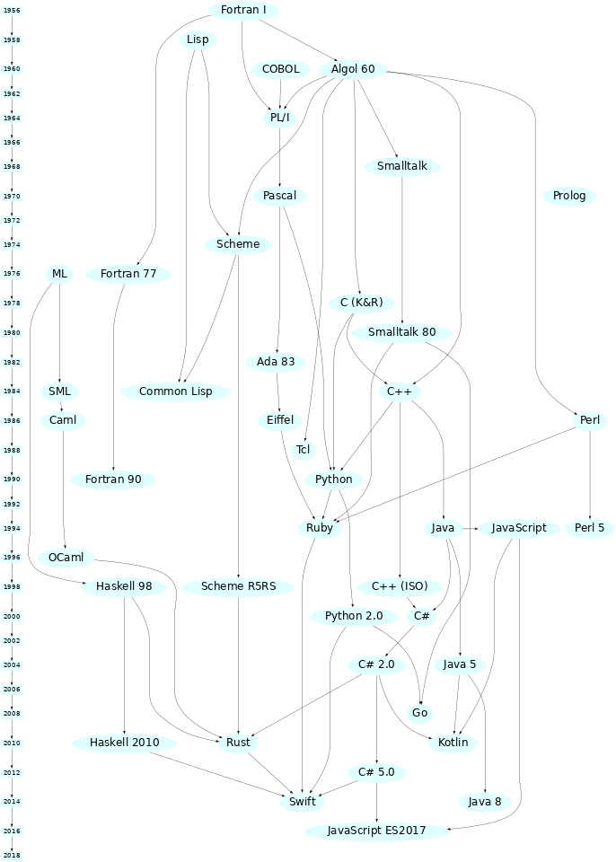

# Lecture 1
- arrows between languages signify that the language the arrow begins at influenced the langauge it points to
	- there is no weighting, meaning some languages with several arrows pointing to it may be highly influenced by one language, and less another (for example, Ruby is highly influenced by Python and less so Eiffel)
### fortran
- before fortran things were directly in computer
	- fortran was the first language with a compiler
	- syntax was weird (whatever the compiler accepts works), instead of proper standards
	- used three way "if" statement (had 3 places to jump)
		- if a variable is less than 0 one option, if the variable = 0 a 2nd choice, if the variable is greater than 0 a 3rd option is chosen
		- it was done this way as the hardware had 3 way jump instruction
	- all about scientific computation
- [Wikipedia Page](https://en.wikipedia.org/wiki/Fortran)
### lisp
- soon after fortran came lisp
	- more for computing abstract or symbolic stuff
	- used for "oldies AI" (very basic)
	- dynamic scope for variables, meaning the most recent value assigned to a variable during the program's execution is its current value (fortran had static)
 	- [Lexical and Dynamic Scope](https://prl.khoury.northeastern.edu/blog/2019/09/05/lexical-and-dynamic-scope/)
  	- [More on scope](https://en.wikipedia.org/wiki/Scope_(computer_science))
- [Wikipedia Page](https://en.wikipedia.org/wiki/Lisp)
- [Lisp website](https://lisp-lang.org/)
### COBOL
- Y2K year stored as 2 digits so everyone panicked
	- lots of these programs needed to b fixed
	- COBOL programmers made a lot of money in this times
- made to read like english 
	- "add one to x" is a valid COBOL command
- [Wikipedia Page](https://en.wikipedia.org/wiki/COBOL)
### Algol 60
- influenced many languages, designed by a committee
- first language with a standard
- [Wikipedia Page Algol](https://en.wikipedia.org/wiki/ALGOL)
- [Wikipedia Page Algol 60](https://en.wikipedia.org/wiki/ALGOL_60)
- [Algol 60 Website](https://algol60.org/)
### PL/I ("PL one")
- many features, but they weren't very thought through
- VERY BAD compile efficiency
- described as an "awful langage",  can accomplish things but very mishmashed
- [Wikipedia Page](https://en.wikipedia.org/wiki/PL/I)
- [PL/I IBM documentation](https://www.ibm.com/docs/en/zos-basic-skills?topic=zos-pli)
### Smalltalk
- First truly OO langauge
- Most OO ideas (not already in SImula 67) came from here
- makes "everything else seem like half hearted OO"
- 5 + 3 sends message "+" to obj 5 w/ arg 3
	- 5 has methods and reacts to the message "+", result is object 8
- [Wikipedia Page](https://en.wikipedia.org/wiki/Smalltalk)
### Pascal
- made as teaching language (other languagess were thought to b too complex)
	- supposedly easy for newbies to learn
- good enough that it ended up used in industry + fit on small computers
- [Wikipedia Page](https://en.wikipedia.org/wiki/Pascal_(programming_language)
### Prolog
- almost everything is a relation 
- will studied in this course
- [Wikipedia Page](https://en.wikipedia.org/wiki/Prolog)
# Lecture 2

### ML
- added abstract data types
- The opposite of C in that C lets u see all the gritty details about a type, and this does the opposite
- Cant lie to compiler- it know the types
- (supposedly) enforces more debugging in present to save hassle/debugging down the line
- [Wikipedia Page](https://en.wikipedia.org/wiki/ML_(programming_language))
### Ada 83
- committee made language
- made for US defense for standardized defense stuff
- has "PL1 syndrome", too much stuff mishmashed together
	- It learned from some of PL1's mistakes though, so it is nto as bad
- excellent tooling and pushed forward contracts
	- uses contracts instead of tight data types
- was good for a time as had high insurance (i think)
- [Wikipedia Page](https://en.wikipedia.org/wiki/Ada_(programming_language))
### Eiffel
- well designed, perfected contracts 
- added strong concurrency
- [Wikipedia Page](https://en.wikipedia.org/wiki/Eiffel_(programming_language))
### Ruby
- not strong connection to eiffel- mainly from python
- "python redone but fixing Pythons mistakes"
	- uses Python paradigm
- [Wikipedia Page](https://en.wikipedia.org/wiki/Ruby_(programming_language))
- [Ruby website](https://www.ruby-lang.org/en/)
### Python
- no types, layout sensitive syntax
- didn't bring any new ideas, very standard language
- [Wikipedia Page](https://en.wikipedia.org/wiki/Python_(programming_language))
### rust
- generally good language
- slightly ruined by higherup politics
- [Wikipedia Page](https://en.wikipedia.org/wiki/Rust_(programming_language)
- [Rust Controversy](https://www.looper.com/1209567/the-entire-rust-shooting-controversy-explained/)
- [Interesting Reddit discussion on the Rust controversy](https://www.reddit.com/r/rust/comments/12lb0am/can_someone_explain_to_me_whats_happening_with/)
- [Rust guide book (free)](https://doc.rust-lang.org/stable/book/)
### D
- An improved version of C
- [Wikipedia Page](https://en.wikipedia.org/wiki/D_(programming_language)
- [D language Website](https://dlang.org/)
### Forth
- influenced PDF (portable document format)
- Mostly used for imbeded software
- old but still in use today
- [Wikipedia Page](https://en.wikipedia.org/wiki/Forth_(programming_language))
- [More info](https://www.forth.com/forth/)
### postscript
- binary of pdf has postscript!
- stack based, dictionary is principle data structure
- [Wikipedia Page](https://en.wikipedia.org/wiki/PostScript)
### SEQUEL
- Described as "not that interesting"
- The newer version, SQL, is a turing complete language. This may not be this a good thing because since the language is Turing complete, there is no way to calculate how much time it will take to execute a query, whereas you could easily compute and optimize queries in the previous versions.
- The newer version, SQL, is turing complete
	- not necessarily good as you can no longer calculate how long it takes to execute a query
	- It is a reason why not many people use SEQUEL instead
- [Wikipedia Page](https://en.wikipedia.org/wiki/SQL)
### SH
- SH stands for shell
	- despite common belief it is a full programming language! 
- Microsoft powershell does NOT look like sh, it was a complete redesign
- [Wikipedia Page](https://en.wikipedia.org/wiki/Shell_script)
### OS2 (not testable material, fun info)
- An operating system
- Very dead, was made by a microsoft and IBM collab
- Series of computer operating systems
- [Wikipedia Page](https://en.wikipedia.org/wiki/OS/2)
### APL
- Stands for A Programming Language
- Primary data structure is arrays 
- Strange syntax
- [Wikipedia Page](https://en.wikipedia.org/wiki/APL_(programming_language)
- [Try APL yourself here](https://tryapl.org/)
### SaC
- descendant of APL, stands for Single assignment C
- Purely functional
- [Wikipedia Page](https://en.wikipedia.org/wiki/SAC_programming_language)
- [SaC Website](https://www.sac-home.org/index)
### Snobol
- influenced other languages because of its regular expressions
- Has patterns as a first-class data type
- [Wikipedia Page](https://en.wikipedia.org/wiki/SNOBOL)

# Full Graph

